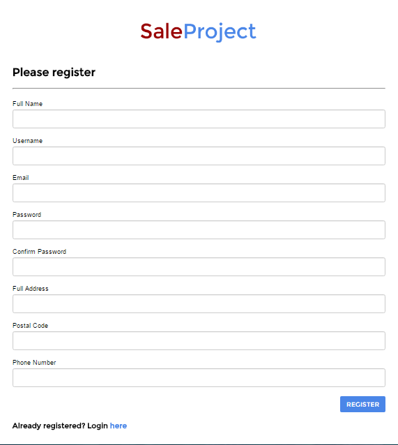
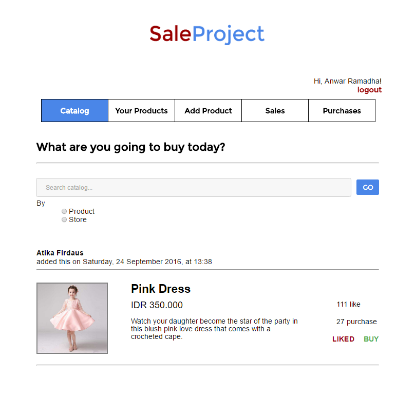
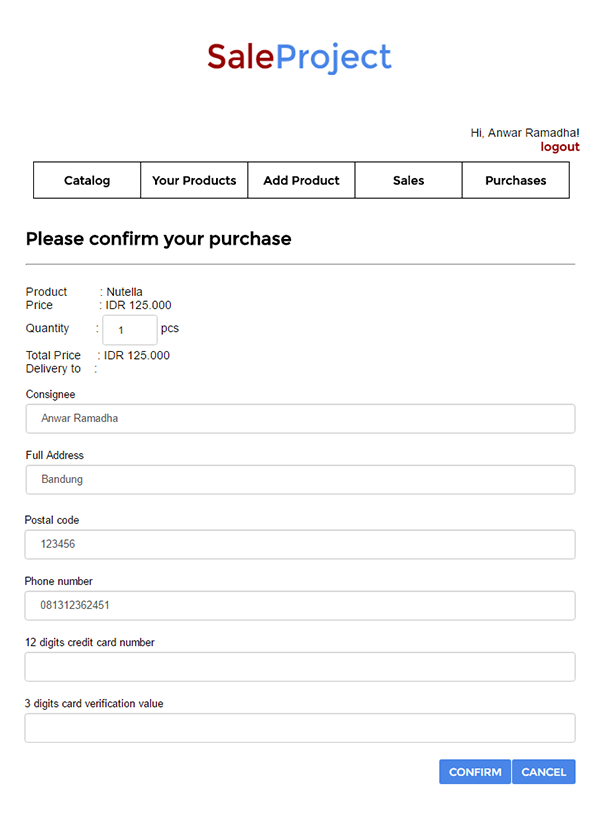
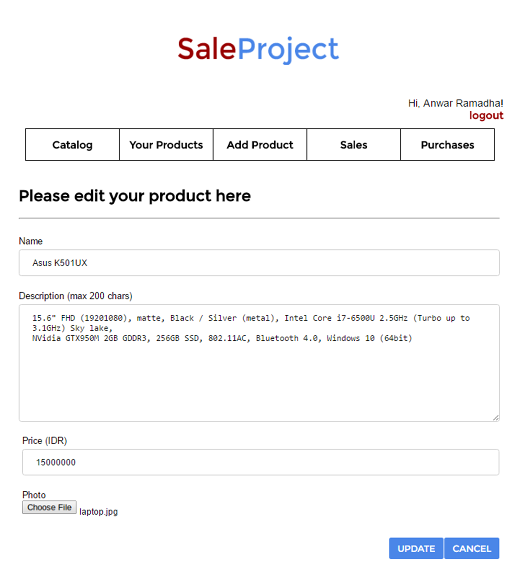
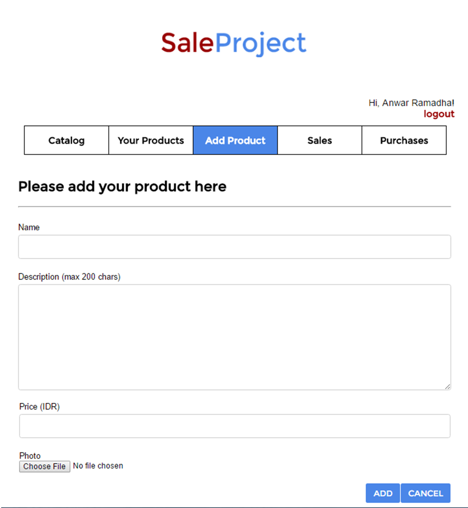

# Tugas 1 IF3110 Pengembangan Aplikasi Berbasis Web

Membuat Website Marketplace sederhana.

## Anggota Tim
1. 13514009 - Atika Firdaus
2. 13514013 - Anwar Ramadha
3. 13514049 - Ade Surya Ramadhani

## Pembagian kerja
Tampilan 
1. Login : 13514013
2. Register : 13514013
3. Catalog : 13514013
4. Add barang : 13514049
5. Your product : 13514009, 13514049
6. Sales : 13514009
7. Purchases : 13514009

Fungsionalitas
1. Login : 13514013
2. Register : 13514013
3. Filter catalog : 13514013
4. Like : 13514013
5. Dislike : 13514013
6. Edit barang : 13514049
7. Hapus barang : 13514049
8. Tampilkan your product : 13514049
9. Upload foto : 13514049
10. Tambah barang : 13514049
11. Validasi semua form : 13514009, 13514013, 13514049
12. Tampilkan barang yang telah dibeli oleh orang lain: 13514009
13. Tampilkan barang yang dibeli sendiri : 13514009
14. Confirm Purchase : 13514013

## Hasil kerja tim
Berikut adalah hasil pengerjaan tugas oleh kelompok kami.

### Login
Login merupakan halaman yang pertama kali dilihat oleh pengguna ketika memasuki *website*. Pengguna diminta untuk
memasukkan username dan password akun yang dimiliki sebelum memulai berbelanja di SaleProject.

### Register
Belum memiliki akun? Pengguna hanya perlu mendaftarkan dirinya untuk mendapat akun baru kemudian dapat berbelanja
di SaleProject. Tombol untuk memulai register terdapat pada laman login. Pada registrasi, pengguna diminta memasukkan
beberapa data diri. Setelah registrasi berhasil dilakukan, pengguna kini memiliki akun dan dapat berbelanja di SaleProject.

### Catalog
Pada catalog, pengguna dapat melihat seluruh barang yang dijual di SaleProject. Pengguna juga dapat melakukan pencarian menggunakan kata kunci berdasarkan nama produk atau nama penjual. Jika pengguna bingung memilih barang
mana yang harus dibeli, SaleProject dapat membantu pengguna melalui jumlah *likes* dan *purchases* dari setiap
barang yang dapat dijadikan referensi terkait kepopuleran barang tersebut. Dan tentu saja, pengguna dapat memberi
*like* serta membeli barang yang ada di catalog.

### Confirmation Purchase
Saat akan membeli suatu barang, pengguna diminta mengisi data konfirmasi meliputi kuantitas barang yang ingin dibeli
serta informasi pengiriman barang.

### Your Products
Halaman ini berisikan list barang yang dijual oleh pengguna. Pada menu ini, pengguna dapat melakukan edit dan delete pada barang.

### Edit Product
Pengguna dapat mengubah info barang yang sudah sebelumnya telah dijual. Form yang digunakan memiliki tampilan yang sama dengan form untuk add product, namun field-field yang ada sudah terisi.

### Add Product
Pengguna dapat menambahkan barang yang ingin dijual.

### Sales
Halaman ini berisi histori penjualan barang yang dijual oleh pengguna.

### Purchases
Halaman ini berisi histori pembelian barang oleh pengguna.

